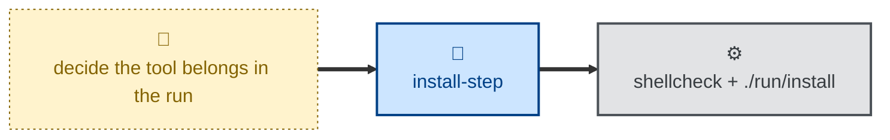

# Install step

The procedure for adding a tool to the bootstrap provisioning run, changing
how an existing tool is installed, or removing one.

The skill walks an agent through the whole change, not just the shell
script: picking the right group under `run/inc/`, writing the step file from
the project's template, wiring the call into `run_install_steps` through the
wrapper for the tool's install profile (`agent_step`, `tui_step`, or
`gui_step`), then updating `CHANGELOG.md`, `docs/tools.md`, and
`NOTES.md`, and finally linting and smoke-testing the result. It
deliberately stops at the shared helpers in `run/inc/fn/` — those are
infrastructure, and changing them is a different kind of change.

## Interactivity

Non-interactive. The agent resolves the tool, the operation, and the install
profile from context and from the repository, and never blocks on user
input, so the skill can be used in away-from-keyboard workflows. Where the
requirements cannot be determined, the agent stops with an error rather than
asking.

The *bootstrap run itself* is also non-interactive: every step runs
unattended, with no per-tool prompt.

## How to invoke

> Add ripgrep to the bootstrap.

> Install lazydocker on new machines.

> Move Obsidian to the gui profile.

> Drop Insomnia from the bootstrap.

## Recommended models

A mid-tier model is a good fit. Most of the work is mechanical — a template,
a sorted call site, three documentation tables — but classifying a tool into
the right profile and choosing an install mechanism call for some judgment,
and getting the profile wrong quietly bloats the headless container image.

## Suggested workflows

Run the skill once per tool, as its own change. Run ShellCheck and the smoke
test before opening a pull request, since neither the wiring nor the
documentation rows are validated automatically.

## Related skills

- [**apt**](../apt/) \
  Covers the narrower question of how an individual APT call is written —
  `apt-get` over `apt`, `-y`, `superdo`, and when an `apt-get update` is
  needed. Most steps this skill produces contain such a call, so the two are
  usually applied together.

## References

- [`AGENTS.md`](../../AGENTS.md) — project-wide bootstrap rules.
- [`docs/installation.md`](../../docs/installation.md) — entry scripts and
  install profiles.
- [`docs/tools.md`](../../docs/tools.md) — the Agent/TUI/GUI table.
- [`NOTES.md`](../../NOTES.md) — comparison against the private
  `hacksltd` bootstrapper.
